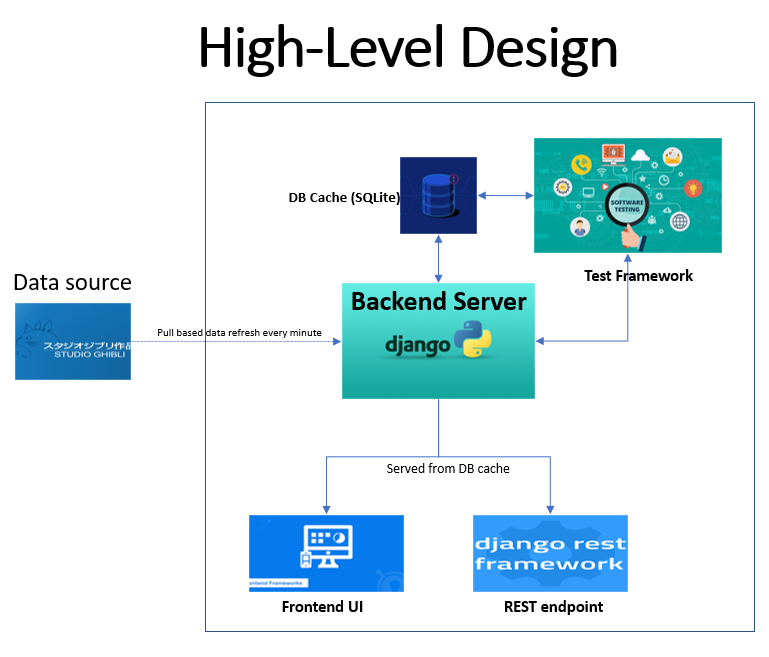
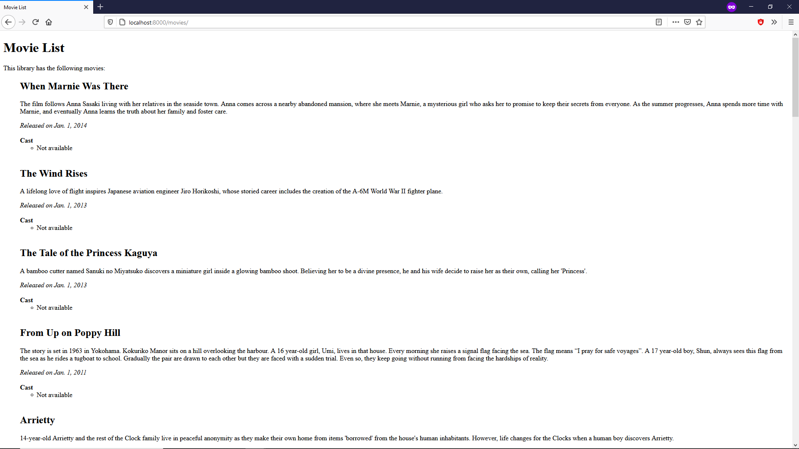
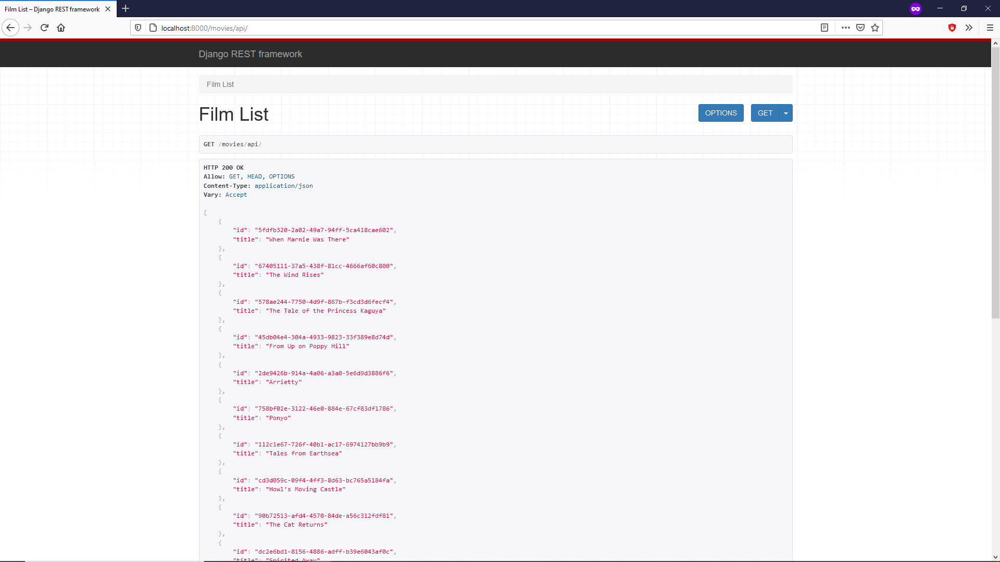
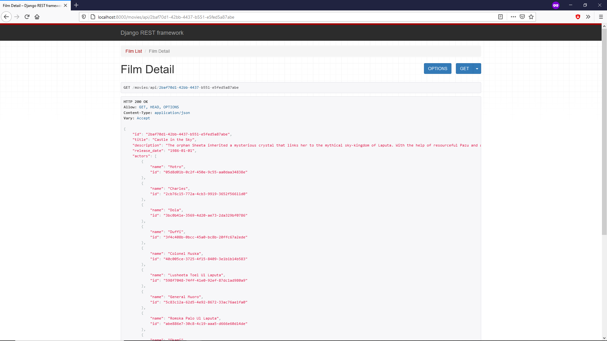
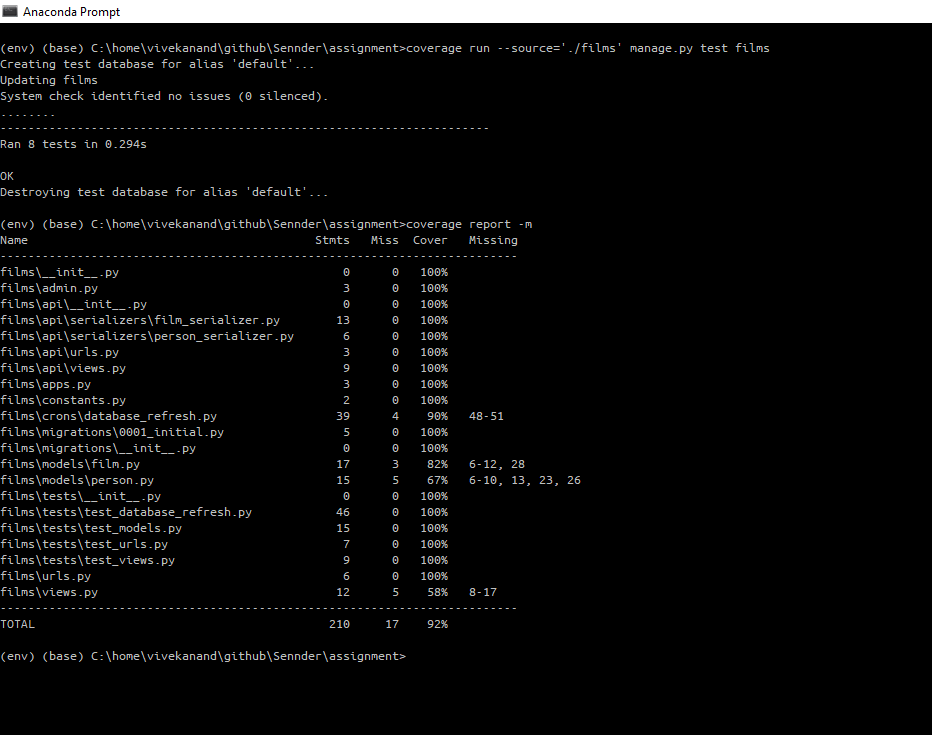

# Django based back-end application

This Python backend application serves on localhost:8000/movies/ a plain list of all movies from [Ghibli API](https://ghibliapi.herokuapp.com/) with a list of people who appear in the movie.



---

## Design Decisions
1. Rest API framework: Django
    - Good documentataion and support
    - Rapid development (rest framework, admin console, security, localization, performance and optimization)
    - Python-based
    - In-built Object-Relational-Mappers (ORMs)
    - Unittest capabilities
2. Database: SQLite
    - Well-defined structure for input and API data
    - Performant due to native memcache/DB cache
    - Complex queries are not expected
    - Scalability isn't a concern as total movies aren't expected to cross 2^64-1
---

## Steps to launch local server
1. Download source from git
    ```
    git clone https://github.com/iVivekanand/MovieList.git && cd Sennder
    ```
2. Create virtual environment
    ```
    python -m venv env
    ```
3. Activate the created virtual environment
    ```
    env\Scripts\activate
    ```
4. Install dependencies
    ```
    pip install -r requirements.txt
    ```
5. Setup DB schema
    ```
    python manage.py makemigrations
    python manage.py migrate
    ```
6. Start server
    ```
    python manage.py runserver
    ```
---

## Sample Output
1. localhost:8000/movies


2. localhost:8000/movies/api


3. localhost:8000/movies/api/\<film-id\>


4. Unit tests and code coverage
    ```
    coverage run --source='./films' manage.py test films
    coverage report -m
    ```
    

---

## Backlog
1. Database
    - Bulk save on new data, transaction management (ACID property)
    - DB cache verification
    - Separate server for cronjobs (django-crontab does not work on windows)
2. Testing
    - Unit tests
        - empty database homepage
        - single entry homepage
        - multiple entries homepage
    - Integration tests
    - End-to-end/UI test with Selenium
3. Live Hosting
    - Heroku needs MySQL/PostGreSQL, no support for SQLite
    - DB migration from SQLite to PostGreSQL

---
